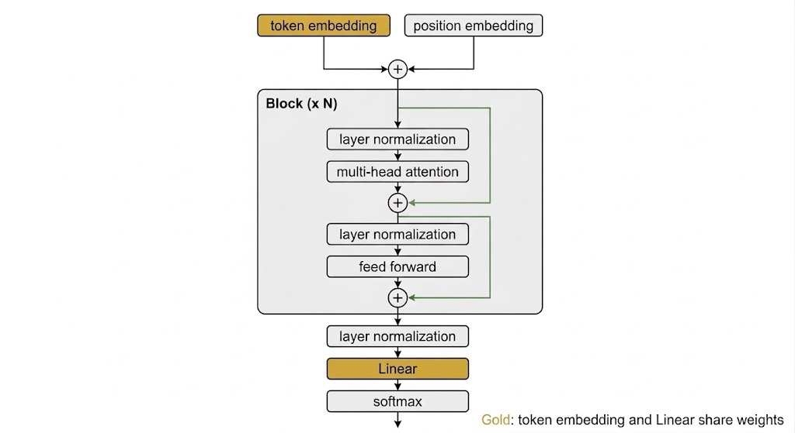

# NepGPT

Decoder-only GPT implemented in PyTorch. Trained and tested on a Nepali literature corpus.

This project is mostly based on the architecture demonstrated in Andrej Karpathy's [nanoGPT lecture](https://github.com/karpathy/ng-video-lecture) and [build-nanogpt](https://github.com/karpathy/build-nanogpt), with the implementation refactored into `model.py`, `train.py`, `utils.py`, and `dataset.py`.

`dataset.py` adds `CharTokenizer`, `NepaliTokenizer`, and `BatchSampler`. `BatchSampler` supports both random overlapping windows (`with_replacement=True`) and non-overlapping chunks traversed once per epoch (`with_replacement=False`, with optional shuffling). `scripts/download_archive_texts.py` downloads the Nepali texts listed below. `train.py` exposes device and model configuration through command-line arguments. `full_working_gpt.ipynb` contains the same model in a single notebook using `CharTokenizer`.

## Tokenization and Sampling

`dataset.py` includes:

- `CharTokenizer` — character-level tokenizer used by `train.py` and `full_working_gpt.ipynb`.
- `NepaliTokenizer` — word and punctuation-based tokenizer supporting Nepali punctuation such as `।` and `॥`.
- `BatchSampler` — generates training windows from a one-dimensional token tensor.

`BatchSampler` supports sampling with and without replacement. When sampling without replacement, it walks through non-overlapping chunks once per epoch, optionally shuffling the chunks first.

## Nepali Texts

`munamadan.txt` is included as a local training file for a quick test run.

`scripts/download_archive_texts.py` downloads additional Nepali literary texts from the Internet Archive:

- **Muna Madan** — Laxmi Prasad Devkota
- **Bhanubhakta Ramayan** — Bhanubhakta Acharya
- **Sumnima** — B. P. Koirala

## Training

Example command for training on Apple Silicon using MPS:

```bash
python train.py \
  --device mps \
  --input munamadan.txt \
  --num-embed 64 \
  --num-heads 4 \
  --num-layers 4 \
  --block-size 32 \
  --batch-size 64 \
  --lr 3e-4 \
  --max-iters 5000 \
  --dropout 0.0
```

The `--device` argument supports `cpu`, `cuda`, and `mps`, with `cpu` as the default.

Batch sampling options include:

- `--with-replacement` / `--no-with-replacement`
- `--shuffle` / `--no-shuffle`

> `--shuffle` applies when sampling without replacement.

## Sample generation

After training (`model.generate`):

```
एक्‌ दिन्‌ नारद सत्यलोक पुगिगया । १९० १ इसमालाई सत्रीव प्यटा पिएर भरिदीयो । 
क अनेक्‌ शिर पौ कहीं । २७ = 


नेपाली-ह -कष्ट ? इस प्रकार थिन ने बाण भरत | ८६ भा‌ उसन्ह्योगो दै ध्यान हुजस्‌ र लढामेरंका 
उत्तरसूर्यको यदि त हुन्‌ 
यस्ता प्रदाहौजन्‌ पनि तटाइ छन्‌  माथिन लाग्यो ।१२३ 
ता


दरद वीर्‌ दयेष्ट पयँ । 


पहुंगा) जो दुः सिद्‌ भनी, 
यो कह्याडा फङडयाथमै बोली उकाए, 
सरमभिरिलाइ आँडी र उसल्को सुपेको छ । 
सुम्निमालाइ हकमणं आयी सत्धन यही 
आफैर मै जाकर धारण जल्जिकामा कूनै 
आदै परापुरी थाने नहीं । स्वीबाट पर्वन-विचार करका 
सं मेरा) 
पापसे प्रकारसाभी हौ सो शक्तु गर्नुपरिन्थ्यौ कजवार्‌ 
सो जल्दि सवं आज जातः आज वा ब्रह्मणजिवती का बीच देने पासच्यादि सोने जारने! कतन्‌ अधि कि सुँठुस्भरिलाई 'सब सूग्रीवप्‌ ॥। १४॥ 
राम्रती आज याचनी सव्‌ ॥ 
सग्रीता मनि वधूमत्‌ विनाऊ ' 
बाट तुरक्ष्टि पनि। 
गन्छन्‌ दीव्या हूौ उभिया। जब ॥ 


मस्ये कूल कुशना बागत्यो,- ““हिर्किनन अभी तागल मताइदि अ।. 


हेरेको छोडे ! भहांस्रा जसै। 
मंं अहो। 
उदान आई मूखमा छिप्यो । सुम्निमाका मध्न थालकर जाउँहि सव 
टक्कारन्‌ पौौ । ३३ वात चुकडसे हुए जाओ अहूव होसे किराँदहै। १९४ 
उसवेध प्रकार के प्रसन्त की अत्यनि-लिए 


दुवद्‌ -जा2॥ 


सवा जानिम्मा ्ठो। 


इन्‌ बाणीमा पनि ति `वताँं , बालि पहिँडेर खाचेको हाँसाको । उसलो 
जदि पसाढ बा॥ 
को सो भुमि“ गरा, रावणीको नुम्? 
झुँ कूलिसिमालाई रेरमा , टुँदैन धरकर श्रीराम तेहीरण प्रस मनथो करसेही एक शरीरौनाह सीताजी 
हाथ को रहाथ करने कि की करो यहा कि समेतादहै।ज मनका. यो देखही भक्त,- “का - माथि,. 


पूवि यह्‌ सुन्या कोमले नत्रहाबखते 
लाग्यो राम्‌का जजहसे। 
जाकर ने वृष्टि सकै क्षकोइनसके गै घार र पछि लिन नभएकी सोचकर जटाक्को 
सस्ले खान
```

😅 Still a baby starting to babble words.

## Model Configuration

`ModelConfig` defines the vocabulary size, context length, model width, number of attention heads, number of Transformer blocks, and dropout rate.

`train.py` builds the configuration from the tokenizer vocabulary size and the command-line arguments.

```python
@dataclass
class ModelConfig:
    vocab_size: int = 50257
    block_size: int = 256 # context window
    num_embed: int = 384 # embedding dimension
    num_heads: int = 6 # number of attention heads
    num_layers: int = 6 # number of transformer blocks
    dropout: float = 0.0 # dropout rate
```

```python
def main():

    ...

    config = ModelConfig(
        vocab_size=vocab_size,
        block_size=args.block_size,
        num_embed=args.num_embed,
        num_heads=args.num_heads,
        num_layers=args.num_layers,
        dropout=args.dropout,
    )

    model = GPTModel(config).to(device)
```

## Model Architecture



The model is a decoder-only Transformer: input tokens are converted to embeddings, positional information is added, and the resulting representations pass through a stack of causal self-attention and feed-forward layers with residual connections before being projected back to vocabulary logits for next-token prediction.

The architecture follows the Transformer introduced in Attention Is All You Need and the decoder-only GPT formulation described in Language Models are Unsupervised Multitask Learners.

### Token and Position Embeddings

Each input token is mapped to a learned token embedding. A learned positional embedding is added to provide information about the token's position in the sequence.

```python
class GPTModel(nn.Module):

    def forward(self, idx, targets=None):

        ...

        tok_emb = self.token_embedding_table(idx) # (B,T,num_embed)

        pos_emb = self.position_embedding_table(
            torch.arange(T, device=idx.device)
        ) # (T,num_embed); the arange needs to on the same device as idx

        x = tok_emb + pos_emb # (B,T,num_embed)
```

The resulting representation is passed through the Transformer blocks.

### Self-Attention

Self-attention allows each token to attend to earlier tokens in the sequence and use their representations when computing its own representation.

Each head computes scaled dot-product attention, as in Attention Is All You Need:

$$\mathrm{Attention}(Q, K, V) = \mathrm{softmax}\left(\frac{QK^{\top}}{\sqrt{d_k}}\right)V$$

$Q$, $K$, and $V$ are the query, key, and value projections of the input. $d_k$ is the head size (`num_embed / num_heads`). Each is $(T, d_k)$: rows are tokens, columns are the head dimension. $QK^{\top}$ is $(T, T)$. The output is $(T, d_k)$ again.

Three tokens, $d_k = 4$ (so $\sqrt{d_k} = 2$):

$$
Q = \begin{bmatrix}
1 & 0 & 1 & 0 \\
0 & 1 & 0 & 1 \\
1 & 1 & 0 & 0
\end{bmatrix},\quad
K = \begin{bmatrix}
1 & 0 & 0 & 0 \\
0 & 1 & 0 & 0 \\
0 & 0 & 1 & 0
\end{bmatrix},\quad
V = \begin{bmatrix}
1 & 0 & 0 & 1 \\
0 & 1 & 0 & 2 \\
0 & 0 & 1 & 3
\end{bmatrix}
$$

$$
QK^{\top} = \begin{bmatrix}
1 & 0 & 1 \\
0 & 1 & 0 \\
1 & 1 & 0
\end{bmatrix}
\qquad
\frac{QK^{\top}}{\sqrt{d_k}} = \begin{bmatrix}
0.5 & 0 & 0.5 \\
0 & 0.5 & 0 \\
0.5 & 0.5 & 0
\end{bmatrix}
$$

$$
\mathrm{softmax}\left(\frac{QK^{\top}}{\sqrt{d_k}}\right) \approx \begin{bmatrix}
0.38 & 0.23 & 0.38 \\
0.27 & 0.45 & 0.27 \\
0.38 & 0.38 & 0.23
\end{bmatrix}
\qquad
\mathrm{softmax}(\cdot) V \approx \begin{bmatrix}
0.38 & 0.23 & 0.38 & 2.00 \\
0.27 & 0.45 & 0.27 & 2.00 \\
0.38 & 0.38 & 0.23 & 1.85
\end{bmatrix}
$$

Row $i$ of the $3 \times 3$ softmax is how much token $i$ attends to the three tokens. That row weights the three rows of $V$.

#### Why divide by $\sqrt{d_k}$

When $Q$ and $K$ have unit-variance elements, the variance of their dot product grows linearly with head size:

$$\mathrm{Var}(QK^{\top}) = d_k$$

Dividing by $\sqrt{d_k}$ restores unit variance:

$$\mathrm{Var}\left(\frac{QK^{\top}}{\sqrt{d_k}}\right) = \frac{d_k}{(\sqrt{d_k})^2} = 1$$

Without that scale, the unscaled scores are large in magnitude. Softmax then saturates: one token gets probability $\approx 1$ and the rest $\approx 0$ (a one-hot / hard-max). Where softmax outputs sit at $0$ or $1$, its derivative is $\approx 0$, so gradients do not reach the $Q$ and $K$ projections.

Take $QK^{\top} = [8,\ 2,\ {-8}]$ and $d_k = 64$ (so $\sqrt{d_k} = 8$):

$$\mathrm{softmax}([8,\ 2,\ {-8}]) \approx [1.00,\ 0.00,\ 0.00]$$

$$\mathrm{softmax}\left(\frac{[8,\ 2,\ {-8}]}{8}\right) = \mathrm{softmax}([1.0,\ 0.25,\ {-1.0}]) \approx [0.62,\ 0.29,\ 0.08]$$

- Unscaled: large $d_k$ $\implies$ high variance $\implies$ extreme $QK^{\top}$
- Forward: softmax becomes one-hot
- Backward: softmax derivative $\approx 0$ (vanishing gradient)
- Fix: $1/\sqrt{d_k}$ keeps variance at $1$, so softmax stays smooth and gradients can flow

Because this is a decoder-only language model, future positions are set to $-\infty$ before the softmax so a token cannot attend to later tokens. That causal mask is described in the paper but is not part of the formula above.

```python
class AttentionHead(nn.Module):

    def forward(self, x):

        k = self.key(x) # (B, T, head_size)
        q = self.query(x) # (B, T, head_size)
        wei = q @ k.transpose(-2, -1) * self.head_size ** -0.5 # (B, T, T)
        wei = wei.masked_fill(self.tril[:T, :T] == 0, float('-inf')) # (B, T, T)
        wei = F.softmax(wei, dim=-1)
        out = wei @ self.value(x) # (B, T, head_size)
        return out
```

### Multi-Head Self-Attention

Instead of using a single attention operation, the model uses multiple attention heads in parallel. Each head can learn different relationships between tokens.

The outputs of all heads are concatenated and passed through a linear projection:

```python
class MultiHeadAttention(nn.Module):

    def __init__(self, config: ModelConfig):

        ...

        self.heads = nn.ModuleList(
            [AttentionHead(config) for _ in range(config.num_heads)]
        )

    def forward(self, x):

        out = torch.cat([h(x) for h in self.heads], dim=-1) # (B, T, num_heads * head_size)

        out = self.proj(out) # (B, T, num_embed)

        ...
```

### Feed-Forward Network

After self-attention, each Transformer block applies a position-wise feed-forward network independently to each token representation.

The attention and feed-forward sublayers together form the core computation performed by each Transformer block.

### Residual Connections and Layer Normalization

Each Transformer block uses a pre-norm residual architecture. Layer normalization is applied before each sublayer, and the sublayer output is added back to the input through a residual connection:

```python
class Block(nn.Module):

    def forward(self, x):

        # layers: layer normalization -> self-attention -> residual connection -> layer normalization -> feedforward -> residual connection
        x = x + self.sa(self.ln1(x)) # residual connection after self-attention # (B, T, num_embed)

        x = x + self.ffwd(self.ln2(x)) # residual connection after feedforward # (B, T, num_embed)

        return x
```

Multiple such blocks are stacked according to `config.num_layers`.

### Output Projection and Weight Sharing

After the final Transformer block, the hidden representation is projected to vocabulary logits using the output linear layer.

The model shares the weights of the token embedding layer and the output projection layer:

```python
class GPTModel(nn.Module):

    def __init__(self, config: ModelConfig):

        ...

        # weight sharing between token embedding and language model head
        self.token_embedding_table.weight = self.head.weight
```

This weight sharing connects the representation used to encode input tokens with the representation used to predict output tokens.

### Weight Initialization

Linear and embedding weights are initialized from a normal distribution with mean `0.0` and standard deviation `0.02`.

Linear biases are initialized to zero, while LayerNorm uses PyTorch's default initialization.

Residual-output projections in `model.py` are then scaled by $1/\sqrt{2L}$, where $L$ is `num_layers`, as described below.

```python
class GPTModel(nn.Module):

    def _init_weights(self, module):

        # Initialize weights for linear and embedding layers; not other layrs like LayerNorm etc.
        if isinstance(module, nn.Linear):

            std = 0.02
            # Scale down the std for residual projection layers to avoid large activations.

            if getattr(module, 'merges_to_residual', False):
                std *= (2 * self.config.num_layers) ** -0.5  # times 2: two residual additions per block

            nn.init.normal_(module.weight, mean=0.0, std=std) # mean=0.0, std=std as described in GPT-2 paper
            # Linear layers may have bias, so initialized to zero as described in GPT-2 paper
            if module.bias is not None:
                nn.init.zeros_(module.bias)

        elif isinstance(module, nn.Embedding):

            nn.init.normal_(module.weight, mean=0.0, std=0.02)
```

> [!NOTE]
> `full_working_gpt.ipynb` uses a flat weight initialization (`std=0.02` for every linear and embedding layer) for simplicity. It does not scale residual-projection weights by `num_layers`.
>
> ```python
> class GPTModel(nn.Module):
>
>     def _init_weights(self, module):
>
>         # Initialize weights for linear and embedding layers; not other layrs like LayerNorm etc.
>         if isinstance(module, nn.Linear):
>
>             nn.init.normal_(module.weight, mean=0.0, std=0.02) # mean=0.0, std=0.02 as described in GPT-2 paper
>             # Linear layers may have bias, so initialized to zero as described in GPT-2 paper
>             if module.bias is not None:
>                 nn.init.zeros_(module.bias)
>
>         elif isinstance(module, nn.Embedding):
>
>             nn.init.normal_(module.weight, mean=0.0, std=0.02)
> ```

### Residual Scaling

#### 1. What contributes to increased variance per block?

In `Block.forward(x)`, the hidden state undergoes two sequential residual additions:

```python
x = x + self.sa(self.ln1(x)) # residual connection after self-attention # (B, T, num_embed)
x = x + self.ffwd(self.ln2(x)) # residual connection after feedforward # (B, T, num_embed)
```

Because the variance of independent random variables sums linearly,

$$\mathrm{Var}(A + B) \approx \mathrm{Var}(A) + \mathrm{Var}(B)$$

every `x = x + sublayer(x)` adds the output variance of that branch to the residual stream.

Across `config.num_layers` blocks there are $N = 2L$ residual additions (two per block). Without scaling, activation variance grows linearly with `num_layers`:

$$\mathrm{Var}(x_{\mathrm{final}}) \approx 1.0 + 2L \cdot \sigma_0^2$$

#### 2. Who is the contributor?

The two processing branches inside `Block`:

1. Self-attention (`self.sa`)
2. Feed-forward (`self.ffwd`)

#### 3. Whose weights should be controlled?

Only the layers that write back into the residual stream (`x = x + ...`):

- `MultiHeadAttention.proj`
- `FeedForward.net[2]` (the output linear)

Q, K, and V are not scaled by depth. LayerNorm (`ln1`, `ln2`) keeps their inputs near unit scale, and $1/\sqrt{d_k}$ already keeps attention logits from growing. Those two stop activations inside the head from exploding. What still grows is the residual add, so only `proj` and the feed-forward output get $1/\sqrt{2L}$. The FFN expand layer (`self.net[0]`) stays at $\sigma_0 = 0.02$ for the same reason.

#### 4. The mathematical theory

Scaling a weight matrix by $\gamma$ scales output activation variance by $\gamma^2$:

$$\mathrm{Var}(\gamma \cdot Y) = \gamma^2 \cdot \mathrm{Var}(Y)$$

To give each of the $N = 2L$ residual paths a fraction $1/(2L)$ of the baseline variance, the residual-projection standard deviation is:

$$\mathrm{std}_{\mathrm{residual}} = \frac{0.02}{\sqrt{2L}} = 0.02 \times (2L)^{-0.5}$$

Summing across all $2L$ paths then keeps final variance near unit scale:

$$\mathrm{Var}(x_{\mathrm{final}}) = 1.0 + \sum_{i=1}^{2L} \left(\frac{1}{2L} \sigma_0^2\right) = 1.0 + \sigma_0^2 \approx 1.0$$

`model.py` applies this scale by setting `merges_to_residual = True` on `self.proj` and `self.net[2]`, then using `std = 0.02 * (2 * num_layers) ** -0.5` for those layers in `_init_weights`.

## Project Structure

```text
.
├── LICENSE
├── model.py
├── train.py
├── dataset.py
├── utils.py
├── full_working_gpt.ipynb
├── munamadan.txt
├── scripts/
│   └── download_archive_texts.py
└── docs/
    └── gpt_architecture.jpeg
```

## License

MIT. See `LICENSE`.

## References

- [Attention Is All You Need](https://arxiv.org/abs/1706.03762) — Vaswani et al., 2017
- [Language Models are Unsupervised Multitask Learners](https://cdn.openai.com/better-language-models/language_models_are_unsupervised_multitask_learners.pdf) — Radford et al., 2019
- [Karpathy's nanoGPT lecture](https://github.com/karpathy/ng-video-lecture)
- [build-nanogpt](https://github.com/karpathy/build-nanogpt)